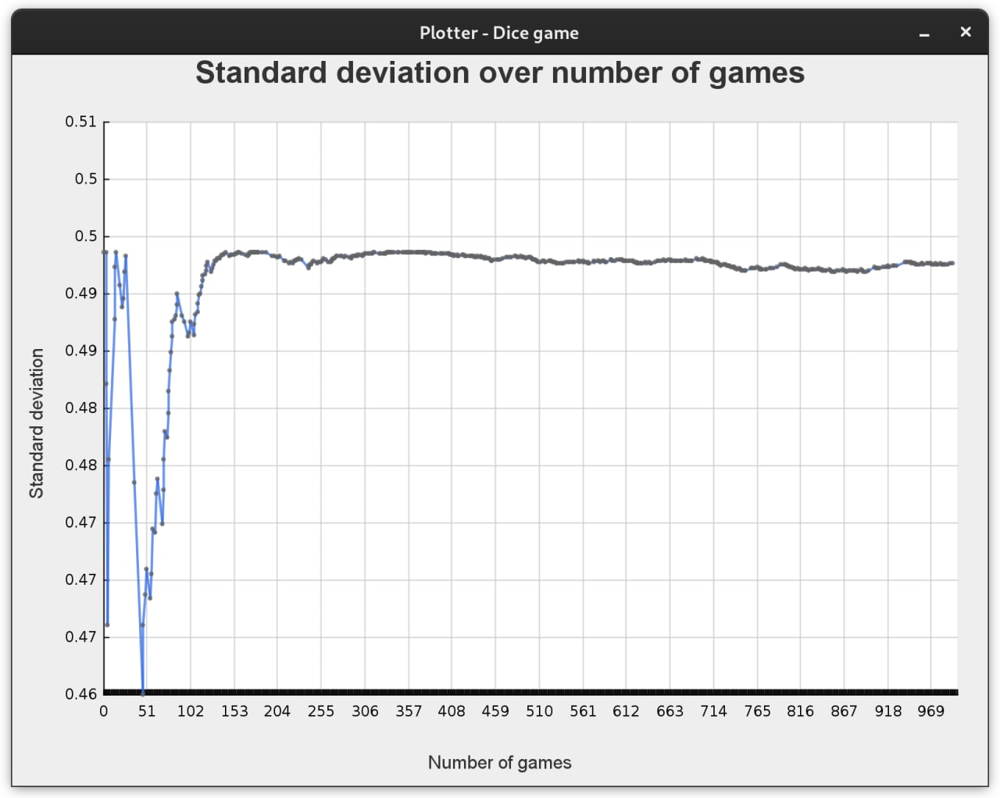

# Dice rolling simulator

Dice rolling game simulating 2 different game types.  
- First game type: roll one die with 4 tries, 6 wins the game.  
- Second game type: roll two dice with 24 tries, double-6 wins the game.  

At the end of the simulation, the mean, variance and standard deviation 
values are exported to a json file and (optionally) displayed on a graph. 




## Dependencies

- Java version 17 LTS is required  
- junit 5 (jupiter, platform)
- json

## Usage

To run the simulation for the first game type execute:  
`java -jar Relax.jar 0`

To run the simulation for the second game type execute:  
`java -jar Relax.jar 1`

Optionally a second parameter can be added to set the number of games to run for the simulation.
The default value is otherwise set to 1000.  
The last optional parameter can be true or false, which will plot the values with the standard deviation.
The default value is false.

Example:  
`java -jar Relax.jar 0 1000 true`

## Testing

Unit tests with junit for the mean, variance and standard deviation calculations can be found in the test directory. 
Execute with:  
```bash
java -jar /path/to/junit-platform-console-standalone-1.8.2.jar --class-path /path/to/Relax.jar --select-class com.weirdloop.diceroller.SimulationTest
```

### Author

Ioannis Panteleakis
